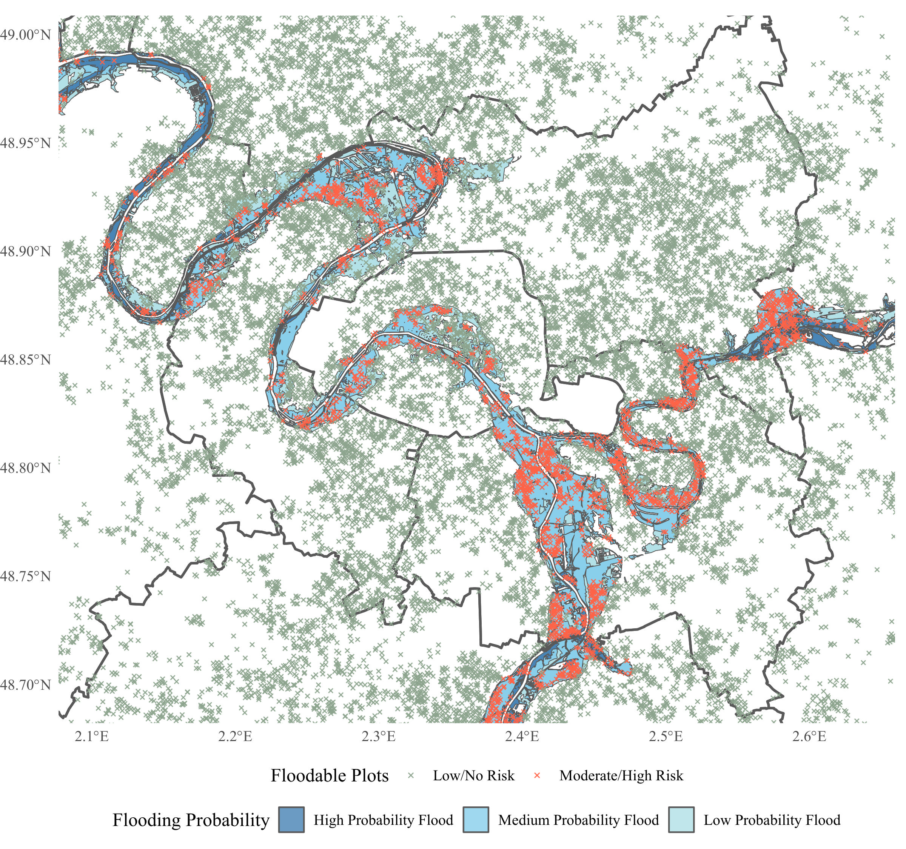

# Catastrophic Risks and Real Estate Markets: Flood Zone Pricing Across Borders

This repository contains the code used for a comparative analysis of flood risk, insurance systems, and real estate pricing in France and the UK. The project explores how flood risks influence property values under France's solidarity-driven CatNat system and the UK's FloodRe scheme.

Key Features:

- Hedonic Pricing Model: Analyze the impact of flood risk on property prices using datasets of real estate transactions and flood risk maps.
- Cross-Country Comparison: Precise description of different insurance regimes
- Data and Tools: Includes geospatial data processing scripts, regression models, and visualizations for reproducibility.
- Economic Implications: Discusses sustainability and efficiency challenges of existing insurance frameworks in light of climate change. 

## French Cadasters

I have made publicly available the results of the geospatial processing, which establish the different flooding risks for each French parcel. This data can, of course, be matched with DVF. The process is visualized below using a 2% sample.

## Data Sources
- UK: Price Paid, Energy Performance Certificate data, and Environment Agency RoFRS data.
- France: Demande de Valeurs Foncières (DVF), GeoRisques maps, and French Cadaster Registry.

For replication purposes, a compressed archive of the `data` folder is available at this [link](https://drive.google.com/drive/folders/1D7xP3QSO4gHwgs2U2FVD8R7Kfs7F7oqG?usp=sharing).

After extracting the data (requires at least 50GB of free storage), you can run any script from the `src` folder. If not, only scripts marked with -A- can be executed.

## Collaboration 
If you are interested in transforming this short project into something more robust, check section 5 of my report. I would be happy to contribute! If you find any bugs or issues, pull requests and issue submissions are welcome.
